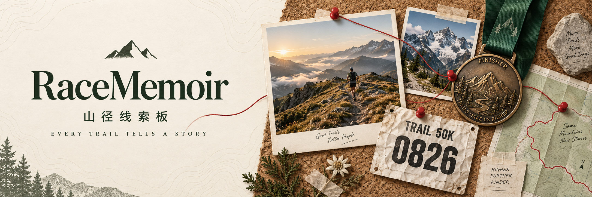
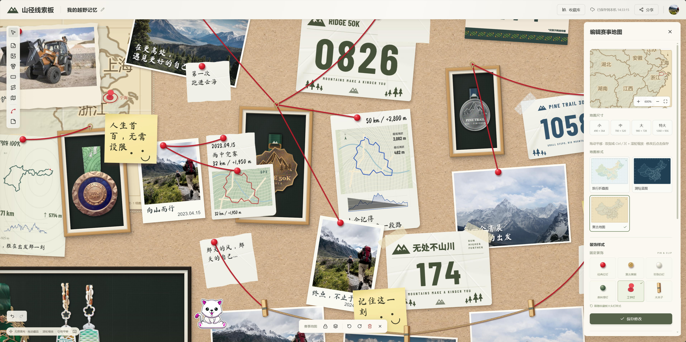

<p align="center">
  
</p>

<p align="center">
  <a href="https://app.racememoir.com"></a>
  
  
  
  
  <a href="LICENSE"></a>
</p>

<p align="center"><a href="README.md">简体中文</a> · English</p>

RaceMemoir is a web-based digital collection board for race memories and outdoor adventures.

Frame your medals, pin up photos, tape down race bibs, and turn GPX tracks into route cards. Arrange them on an infinite canvas and connect your memories with red thread.

---


<div align="center">Make it yours. Arrange everything your way!</div>



<div align="center">Customize each item to suit your style.</div>

## Highlights

- 🖼️ A virtual display wall without physical space constraints.
- 🎖️ A variety of keepsakes to arrange however you like—neat and minimal or delightfully scattered.
- 😊 Runs entirely in the browser, is easy to deploy, and keeps your data locally.

## Features

- ✅ Collect medals, photos, race bibs, notes, stickers, and route cards.
- ✅ Turn uploaded images into cutout stickers with adjustable white borders and sizes, and reuse them from your collection library.
- ✅ Upload photos (including batches), medals, and real race bibs; remove medal backgrounds, crop and rectify bib images, and import GPX routes.
- ✅ Arrange items freely on an infinite canvas, with grouping, locking, alignment, equal spacing, snapping guides, and undo/redo.
- ✅ Use touch gestures on mobile: pinch to zoom and pan, long-press to select multiple items, and adjust photo crops and map views directly.
- ✅ Customize photo paper, frames, and decorations, and connect memories with adjustable curved threads.
- ✅ Combine medals into 1×2, 1×4, or 2×4 display cases, reorder them, and split them back into individual medals.
- ✅ Manage and reuse keepsakes in a collection library, with automatic local saving.
- ✅ Add paper maps to the canvas, mark race locations with red circles and pins, and connect them to your keepsakes.
- ✅ Export high-resolution images and complete ZIP backups, restore your board, and import legacy JSON backups.

## Getting Started

Requires Node.js 22.18+ (Node.js 24 recommended).

```bash
npm install
npm run dev
```

Open [http://localhost:5173](http://localhost:5173).

```bash
npm run build      # Check TypeScript and create a production build
npm run preview    # Preview the production build
npm test           # Run tests
```

## License

Original code in this project is licensed under [GNU AGPL v3.0](LICENSE) (`AGPL-3.0-only`). Third-party dependencies, map data, and assets remain subject to their respective licenses.
