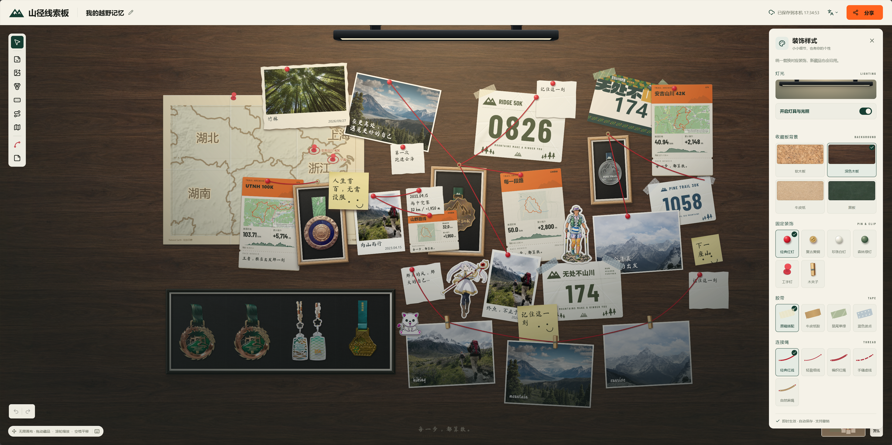

# 山径线索板 · RaceMemoir

山径线索板是一款记录赛事与山野旅程的 Web 数字收藏板。

将真实奖牌装入展示框、照片用大头钉固定、号码布用胶带贴住，把 GPX 轨迹变成路线卡，在无限画布上用红线串联每段记忆。

## 页面预览



## 功能

- ✅ 收藏奖牌、照片、号码布、便签与路线卡。
- ✅ 上传照片与奖牌，自动抠图保留绶带，导入 GPX 展示赛事路线。
- ✅ 无限画布自由排布，支持批量操作与撤销重做。
- ✅ 自定义相纸、展示框与装饰，用可调弧度的红线串联记忆。
- ✅ 收藏库统一管理与复用，本地自动保存。
- ✅ 导出高清图片与 ZIP 完整备份，支持恢复及旧版 JSON 导入。

## 运行

需要 Node.js 22.18+（推荐 Node.js 24）。

```bash
npm install
npm run dev
```

打开 [http://localhost:5173](http://localhost:5173)。

```bash
npm run build      # TypeScript 检查与生产构建
npm run preview    # 预览生产构建
npm test           # 运行测试
```
