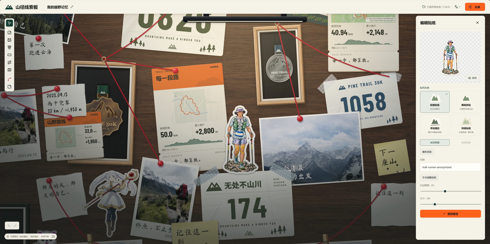
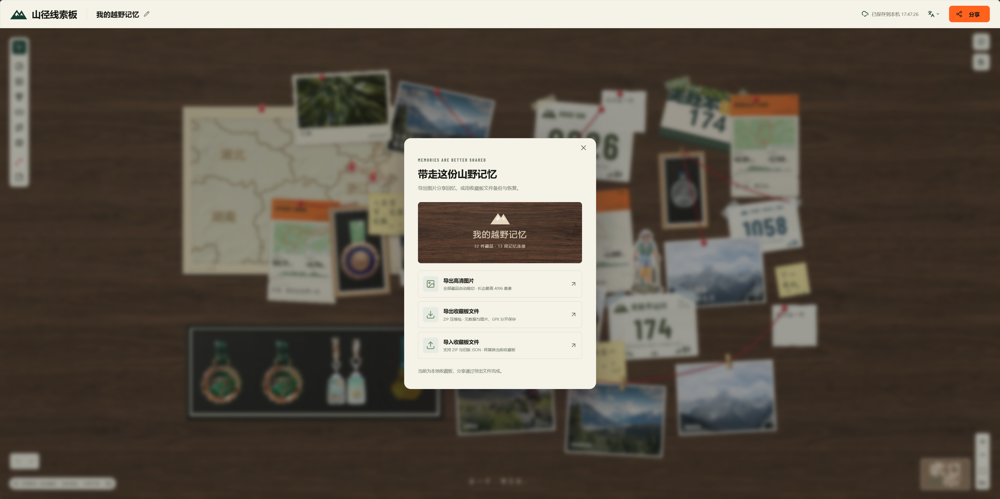

<p align="center">
  
</p>

<p align="center">
  <a href="https://app.racememoir.com"></a>
  
  
  
  
  <a href="LICENSE"></a>
</p>

<p align="center">简体中文 · <a href="README.en.md">English</a></p>

山径线索板是一款记录赛事与山野旅程的 Web 数字收藏板。

将真实奖牌装入展示框、照片用大头钉固定、号码布用胶带贴住，把 GPX 轨迹变成路线卡，在无限画布上用红线串联每段记忆。

---


<div align="center">发挥你的创意，请随意摆放！</div>
<div></div>



<div align="center">自由配置物件，不再受限。</div>
<div></div>



## 特色
- 🖼️虚拟展示墙，不受实体世界的限制
- 🎖️多种物件随心摆放，简约整洁还是随意杂乱有你决定
- 😊纯前端实现，轻松部署，数据保留在本地

## 功能

- ✅ **多样收藏**：奖牌、照片、号码布、便签、贴纸与路线卡，统一入库、随时复用。
- ✅ **素材处理**：批量导入照片、奖牌抠图、号码布裁切与透视校正，一键制作可调白边的轮廓贴纸。
- ✅ **自由排布**：无限画布支持分组、锁定、对齐分布、吸附辅助线与撤销重做。
- ✅ **触屏操作**：双指缩放与平移、长按多选，手势调整照片和地图取景。
- ✅ **个性装饰**：自定义相纸与展示框、组合多块奖牌，用可调弧度的红线串联记忆。
- ✅ **足迹地图**：将纸质地图融入画布，用红圈和图钉标记赛事地点、连接藏品。
- ✅ **路线票根**：导入 GPX 生成赛事票根，呈现真实地图与海拔曲线，自动定位起点并支持调整地点。
- ✅ **保存分享**：本地自动保存，导出高清图片与 ZIP 完整备份，支持备份恢复及旧版 JSON 导入。


## 运行

基础交互使用 [Base UI](https://base-ui.com/)：弹窗、菜单、提示与开关共用键盘操作、焦点管理及浮层定位。

需要 Node.js 22.18+（推荐 Node.js 24）。

```bash
npm install
npm run dev
```

打开 [http://localhost:5173](http://localhost:5173)。

```bash
npm run build      # TypeScript 检查与生产构建
npm run preview    # 预览生产构建
npm test           # 运行测试
```

## 开源许可

本项目原创代码采用 [GNU AGPL v3.0](LICENSE)（`AGPL-3.0-only`）许可。第三方依赖、地图数据及素材遵循各自的许可证。
