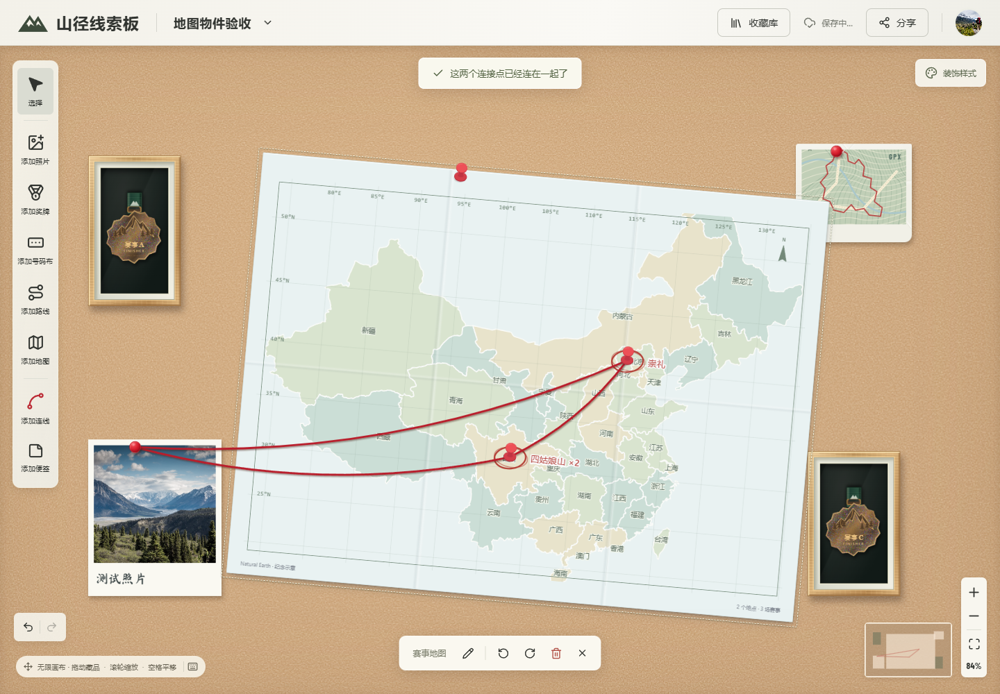

# 赛事地图物件

左侧「添加地图」会在视口中心放置一张 700 × 520 的纸质中国地图。地图可以添加多张，像其他藏品一样移动、旋转、框选、撤销重做，并随收藏板自动保存与导出。原有 GPX 路线卡保持独立。



截图使用测试收藏和模拟地点，不代表示例赛事的真实地点。

## 使用方式

- 在奖牌或路线编辑栏直接添加赛事地点：搜索省区定位，再点击内嵌地图选点并命名。经纬度输入折叠收纳，也可清除已有地点；不读取 GPX 起点。
- 地图只展示当前板上奖牌、路线关联的记录，按记录 ID 去重，再按地点名称和两位小数坐标聚合。在回收站但仍被本板使用的收藏继续显示。
- 提供旅行折叠图、测绘蓝图、复古地图三种外观，含经纬网、坐标边注和指北针；在右侧栏点选缩略图预览，保存后应用，每张地图独立保存样式。
- 单击地图打开右侧栏，选择小、中、大、特大四档尺寸和图形选项中的钉子样式。预览支持 1–10 倍（最高 1000%）缩放、平移和恢复全图，保存后应用。普通滚轮滚动侧栏，Ctrl／⌘ + 滚轮或加减按钮调整地图缩放。画布上的拖动始终移动整张纸。
- 单击地点钉子查看赛事列表，点击赛事打开收藏编辑并定位关联物件。没有地点时保留空地图，提示放在侧栏。
- 开启连线后点击地点钉子；聚合地点需要选择具体赛事。不同地点可连接同一藏品，也可连接同一地图上的其他地点。
- 赛事移出本板、清除地点或移出取景范围时，相关连线暂时隐藏，恢复条件后重现。地图侧栏可查看和删除隐藏连线；彻底删除收藏前必须先删除引用它的地点连线。

## 数据与兼容

新物件类型为 `race-map`，原有 `map` 继续表示 GPX 路线卡。每张地图分别保存标题、位置、尺寸、旋转和 `mapView` 取景；赛事经纬度仍保存在 IndexedDB 收藏记录的可选 `location` 中。旧收藏板不会自动添加地图。

连线保留 `from`、`to` 物件 ID，增加可选 `fromRaceId`、`toRaceId`，以收藏记录 ID 标识地点锚点。保存数据不包含投影像素或地点名称锚点；判重使用完整端点。

ZIP 清单为 **v5**，JSON 保存元数据与文件引用，图片和 GPX 单独打包。继续兼容 ZIP v3/v4、JSON v2 和旧版纯画布 JSON；恢复时同时重映射物件引用及地点端点的记录 ID，保留赛事地点和地图取景。

地图纳入收藏板高清 PNG 导出，包括纸面、底图、文字、红圈、钉子和连接绳，不再提供独立地图页或独立导出入口。

## 实现入口

| 入口 | 职责 |
| --- | --- |
| `src/items/race-map/RaceMapArtwork.tsx` | 画布纸面及纯展示地图 |
| `src/race-map/RaceMapDrawing.tsx` | 复用底图、标签及红圈绘制 |
| `src/race-map/RaceMapEditor.tsx` | 地图编辑、赛事列表与隐藏连线管理 |
| `src/race-map/RaceMapCanvas.tsx` | 侧栏交互预览及地点选择器 |
| `src/race-map/raceMapGrouping.ts` | 当前板记录筛选、去重与地点聚合 |
| `src/board/threadEndpoints.ts` | 投影、取景、尺寸、旋转及完整连线端点解析 |
| `src/race-map/RaceLocationEditor.tsx` | 奖牌与路线的地点表单 |
| `src/persistence/zipArchive.ts` | ZIP v5 备份及兼容恢复 |

实际连线、预览线、缩略图、内容边界及整板导出使用相同端点解析，避免地图移动或旋转后钉线错位。底图静态加载，导出无需等待远程地图资源。

底图及许可见[地图来源说明](../src/assets/maps/README.md)。地图使用本地几何和系统字体，不请求第三方瓦片、地理编码或地图 SDK；本功能不包含 PWA 安装或应用离线启动缓存。

## 验证

```bash
npm test
npm run build
npm run test:browser
```

单元测试覆盖当前板筛选与聚合、取景和旋转坐标、完整端点判重、隐藏与恢复、ZIP 锚点重映射及旧数据兼容。

浏览器回归覆盖多张地图、拖动与框选、侧栏取景、同图地点互连、多个地点连接同一照片、地点修改、删除保护、撤销重做、刷新、空存储 ZIP 恢复及 PNG 实际像素。测试同时检查无外部地图请求。

Playwright 使用独立浏览器上下文和 `127.0.0.1:5187`，不读取个人收藏。Windows 默认使用已安装的 Edge，其他系统先运行 `npx playwright install chromium`；也可通过 `PLAYWRIGHT_CHANNEL` 指定浏览器。临时产物写入被 Git 忽略的 `test-results`。
